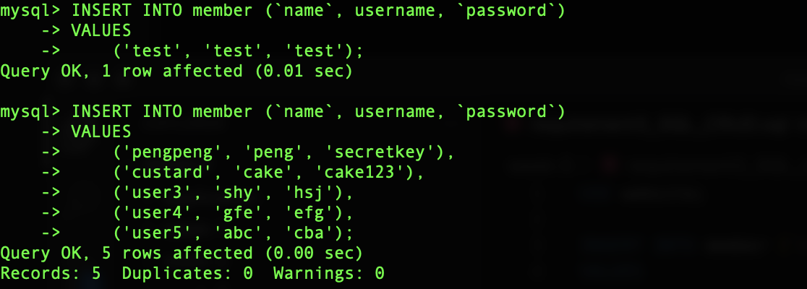
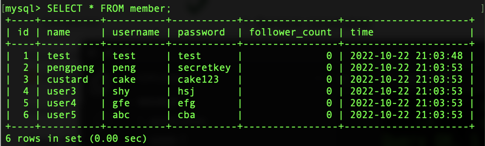
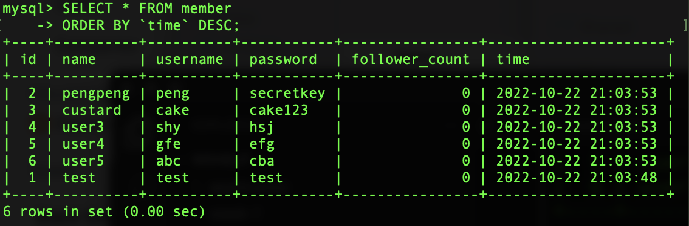
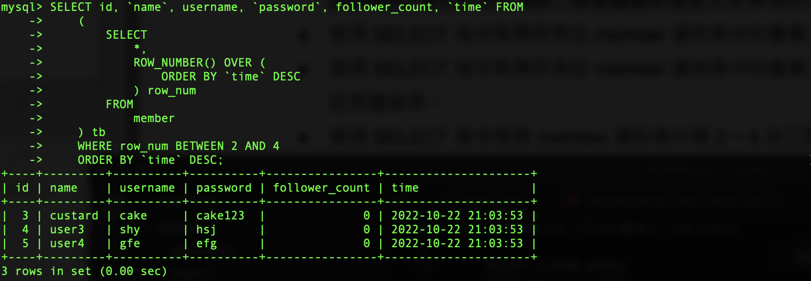
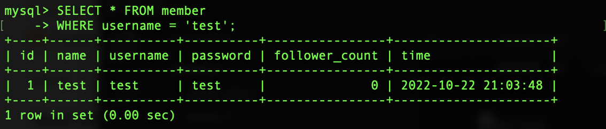
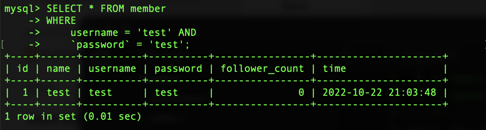
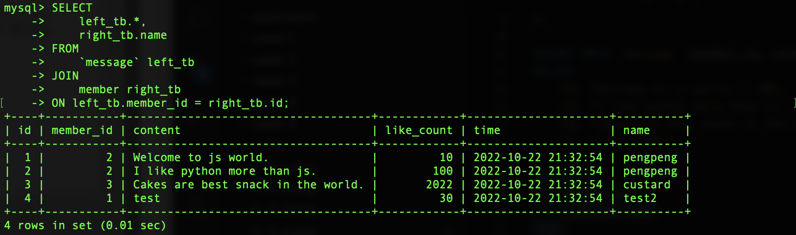

## 要求三：SQL CRUD
    INSERT INTO member (`name`, username, `password`)
    VALUES 
        ('test', 'test', 'test');
    --------------------------------------------------
    INSERT INTO member (`name`, username, `password`)
    VALUES 
        ('pengpeng', 'peng', 'secretkey'),
        ('custard', 'cake', 'cake123'),
        ('user3', 'shy', 'hsj'),
        ('user4', 'gfe', 'efg'),
        ('user5', 'abc', 'cba');

    SELECT * FROM member;

    SELECT * FROM member
    ORDER BY `time` DESC;

    SELECT id, `name`, username, `password`, follower_count, `time` FROM
    (
        SELECT 
            *, 
            ROW_NUMBER() OVER (
                ORDER BY `time` DESC
            ) row_num
        FROM 
            member
    ) tb
    WHERE row_num BETWEEN 2 AND 4
    ORDER BY `time` DESC;

    SELECT * FROM member
    WHERE username = 'test';

    SELECT * FROM member
    WHERE 
        username = 'test' AND
        `password` = 'test';

    UPDATE member 
    SET 
        `name` = 'test2'
    WHERE
        username = 'test'; 

## 要求四：SQL Aggregate Functions
    SELECT count(1) cnt FROM member;

    SELECT sum(follower_count) FROM member;

    SELECT avg(follower_count) FROM member;

## 要求五: SQL JOIN (Optional)
    SELECT 
        left_tb.*,
        right_tb.name
    FROM
        `message` left_tb
    JOIN 
        member right_tb
    ON left_tb.member_id = right_tb.id;

    SELECT 
        left_tb.*,
        right_tb.name
    FROM
        `message` left_tb
    JOIN 
        member right_tb
    ON left_tb.member_id = right_tb.id
    WHERE right_tb.name = 'test';

    SELECT 
        avg(left_tb.like_count)
    FROM
        `message` left_tb
    JOIN 
        member right_tb
    ON left_tb.member_id = right_tb.id
    WHERE right_tb.name = 'test';

